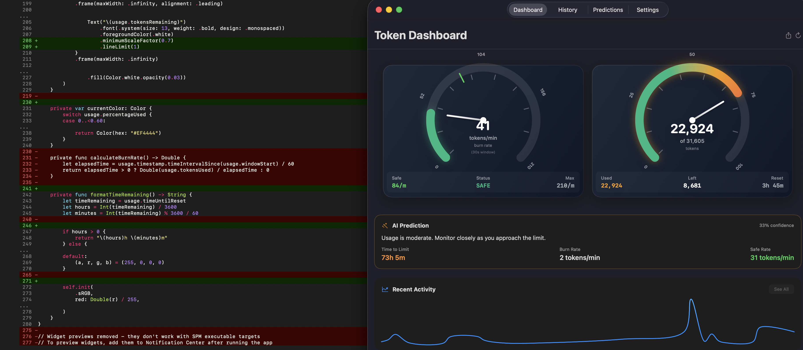

# Anthropic Token Usage Widget for macOS

Slide open your macOS Notification Center while using Claude Code, claude.ai, or any Anthropic-powered tool and instantly see how fast you're burning tokens, where you stand in your current 5-hour window, and your usage trends over the week.

> **Coming soon to the App Store** -- currently awaiting iOS approval. In the meantime, you can build and run it yourself using the instructions below.

## Screenshots



## Features

- Tachometer gauge showing current token usage with color-coded zones (green/yellow/red)
- Real-time burn rate gauge (tokens per minute)
- Usage history graphs
- Usage predictions
- macOS desktop widget (small, medium, and large sizes)
- Dark and light mode support
- Reads usage data from local Claude Code session files (~/.claude/projects)

## Requirements

- macOS 13.0+
- Xcode 15.0+
- Claude Code installed and used (for usage data)

## Build & Run

1. Clone and open in Xcode:
```bash
git clone https://github.com/paulmm/AnthropicTokenWidget.git
cd AnthropicTokenWidget
open AnthropicTokenWidget.xcodeproj
```

2. Set your development team under Signing & Capabilities.

3. Build and run (Cmd+R).

4. Add the widget to your desktop: right-click desktop > Edit Widgets > search "Anthropic Token".

## License

MIT License

---

**Note**: This is an unofficial third-party tool, not affiliated with Anthropic.
